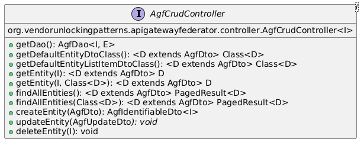
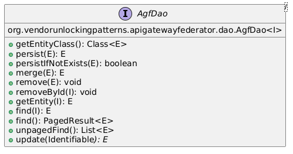
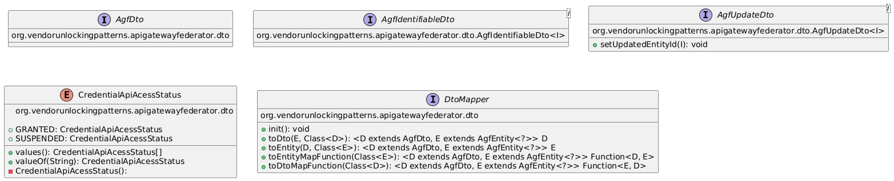
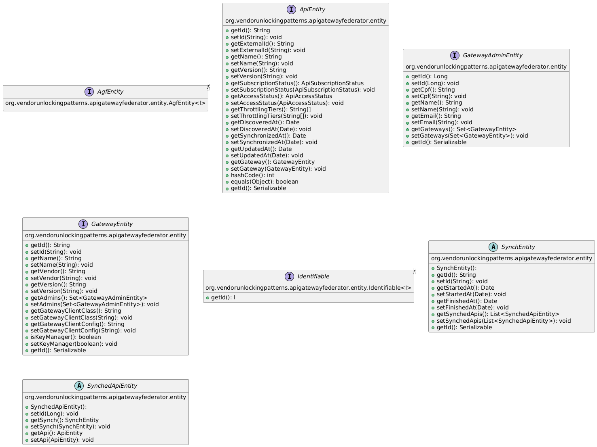
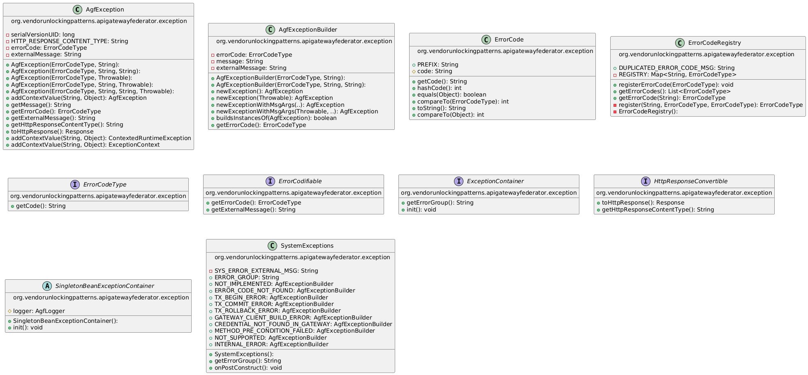
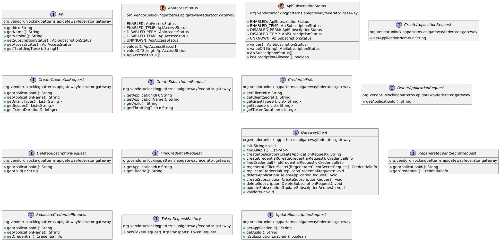
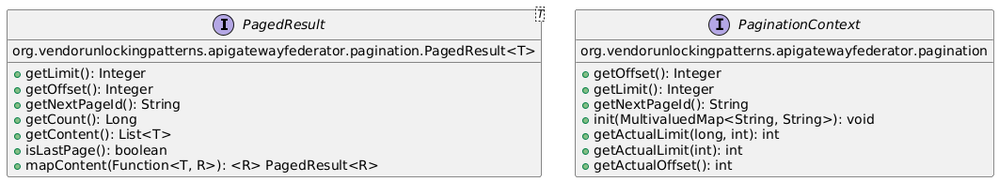
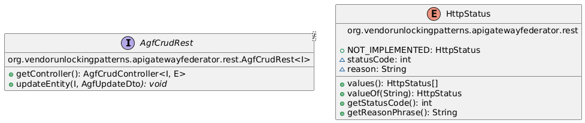
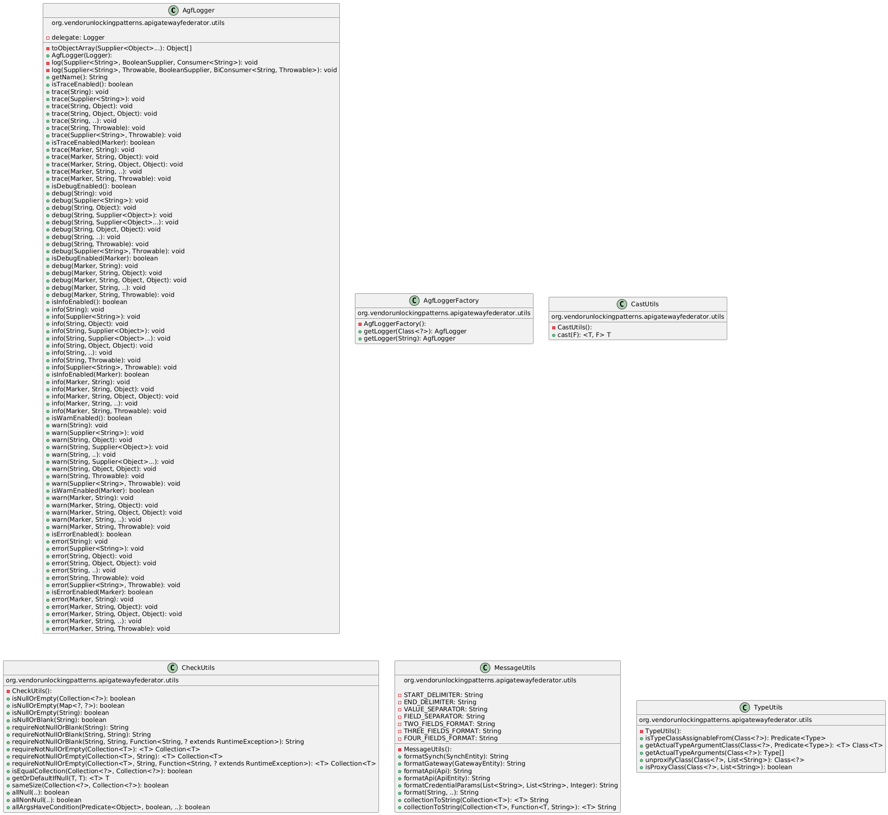
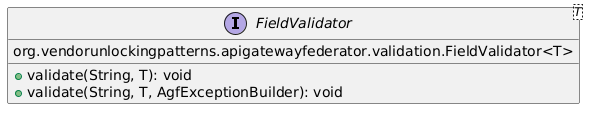

# Class diagrams of the API Gateway Federator pattern

## org.vendorunlockingpatterns.apigatewayfederator.controller

## org.vendorunlockingpatterns.apigatewayfederator.dao

## org.vendorunlockingpatterns.apigatewayfederator.dto

## org.vendorunlockingpatterns.apigatewayfederator.entity

## org.vendorunlockingpatterns.apigatewayfederator.exception

## org.vendorunlockingpatterns.apigatewayfederator.gateway

## org.vendorunlockingpatterns.apigatewayfederator.pagination

## org.vendorunlockingpatterns.apigatewayfederator.rest

## org.vendorunlockingpatterns.apigatewayfederator.utils

## org.vendorunlockingpatterns.apigatewayfederator.validation

